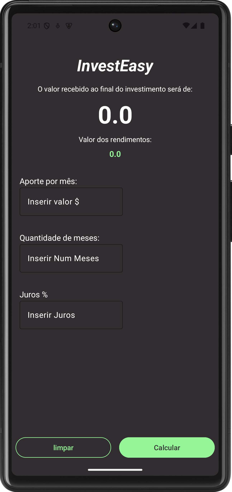
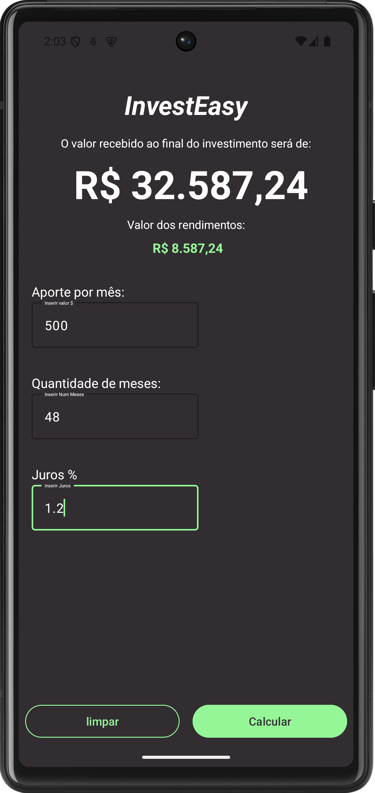

<h2>InvestEasy</h2>
<ul>
    
InvestEasy is a mobile application designed to simplify investment calculations for users. With an intuitive interface and straightforward functionality, InvestEasy helps you calculate the total amount received from an investment based on monthly contributions, duration, and interest rate.

</ul>

<h2>Features</h2>
<ul>
    <li><strong>Real-Time Calculations:</strong> Automatically calculate the final investment amount and total returns based on user input.</li>
    <li><strong>Clear Input Fields:</strong> Convenient "Limpar" button to reset all inputs.</li>
    <li><strong>Dark Theme:</strong> Easy on the eyes and ideal for low-light environments.</li>
</ul>

<h2>How It Works</h2>
<ol>
    <li><strong>Input Details:</strong> Enter the following values:
        <ul>
            <li><strong>Aporte por mês:</strong> The monthly contribution amount.</li>
            <li><strong>Quantidade de meses:</strong> The number of months for the investment.</li>
            <li><strong>Juros %:</strong> The monthly interest rate in percentage.</li>
        </ul>
    </li>
    <li><strong>Calculate:</strong> Tap the "Calcular" button to see:
        <ul>
            <li>The total amount received at the end of the investment.</li>
            <li>The total earnings from interest.</li>
        </ul>
    </li>
    <li><strong>Clear Fields:</strong> Use the "Limpar" button to reset inputs for a new calculation.</li>
</ol>

<h2>Screenshots</h2>
<h3>Home Screen:</h3>

This screen allows users to input their investment details. The calculated results are displayed dynamically.

<h3>Results Screen:</h3>

Displays the calculated total amount and interest earnings based on the provided input values.

<h2>Technology Stack</h2>
<ul>
    <li><strong>Language:</strong> Kotlin</li>
    <li><strong>Platform:</strong> Android</li>
    <li><strong>Design:</strong> Material Design principles</li>
</ul>

<h1>InvestEasy</h1>

InvestEasy is a mobile application designed to simplify investment calculations for users. 
  With an intuitive interface and straightforward functionality, InvestEasy helps you calculate the total amount received from an investment based on monthly contributions, duration, and interest rate.

<h2>How to Run</h2>
<ol>
    <li>Clone the repository from GitHub.</li>
    <li>Open the project in Android Studio.</li>
    <li>Sync Gradle dependencies.</li>
    <li>Build and run the app on an emulator or physical device.</li>
</ol>

<h2>License</h2>

InvestEasy is released under the <a href="./LICENSE">MIT License</a>. Feel free to use, modify, and distribute the app as per the license terms.

<h2>Author</h2>

Developed by <strong>[Your Name]</strong>. For inquiries or feedback, please reach out via <a href="mailto:your-email@example.com">your-email@example.com</a>.

